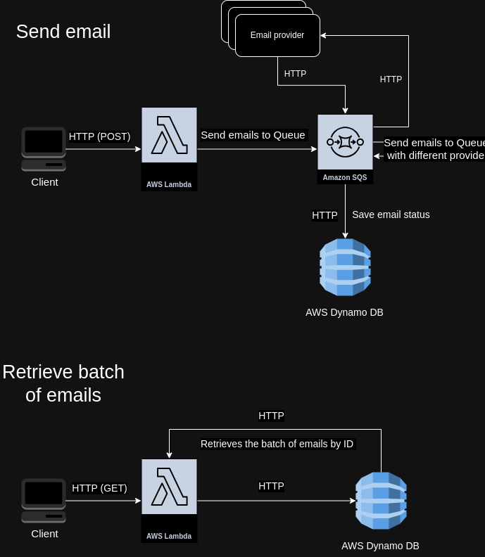

# Challenge-Backend for Woowup

## Architecture

### Diagrams



## Logic

The user can send emails from an email address, to one or multiple recipients.
The email will have a subject and a body.

You can send a POST request to ```/emails/send``` with this information

```
{
	"from": {
		"email": "facundo.chervin@gmail.com",
		"name": "Facundo"
	},
	"destinations": [
		{
			"email": "Pedro@gmail.com",
			"name": "Pedro"
		}
	],
	"subject": "test",
	"plainContent": "test"
}
```

and a Authorization Bearer header with the api_key of the service.

Then the service will send an email for each recipient to an SQS queue.

We have a list of email providers being served in an environment variable.

We have another lambda that is listening to this SQS queue. This queue tries to send the email through the first email provider. If it succeeds, it stores the information in a DynamoDB table with a true status flag indicating that the email delivery was successful. Otherwise, it sends the email back to the queue, but with the next provider in the list. It also writes to the DynamoDB table, but with a status flag false and a retry count of 1.
Next, each time the queue attempts to send the email and fails, it will increment the number of retries.

Each message in the queue has a TTL of one minute, so it will disappear after that time.
We can create a cron to try to send the emails that could not be sent, for this we have to create another field in the dynamoDB table with a timestamp to know when was the last time we tried to send this email.

Then we have a GET request to ``/emails/{id}`` that retrieves the data from the DynamoDB table.

## Testing

There are some unit tests that covers some functions of the email_service.

## Technical choices

So I decided to go with lambdas for the scalability it provides and the low cost associated with using it.
I decided on this implementation of the queuing system, but another approach could be to create as many queues as email providers and send the message through these queues.
As the data we need to store does not need many relationships, the NoSQL database (DynamoDB) seems a good option, it is fast, cheap and we do not need to create a schema (as in a relational database) to make it work.
I'm using SST to deploy the lambda to AWS, because it simplifies the action of building it and uploading it.

## Scalability

The lambda architecture, as well as the DynamoDB database will scale well with a lot of users, and the price will be according the use, as opposed to other tecnology selection that can charge you if your system is not being used.

## Production-readiness

So I include some logs, and error handling. Of course we can upgrade this with more time, but there are the basics logs in case there is an error.

## How to test it?

I added three providers (mailgun,ses,sendgrid). Only sendgrid allows to send emails to addresses that are not preconfigured. The order of the providers in case one fails is mailgun --> ses --> sendgrid.
So if you try to send an email to my address facundo.chervin@gmail.com it will send it with the first provider. In case you want to provide the fail scenario, you can put any other email address and it will send it with the sendgrid provider. So there will be two retries. You will see that if you insert the batch id and press the "Check email batch status" button.
